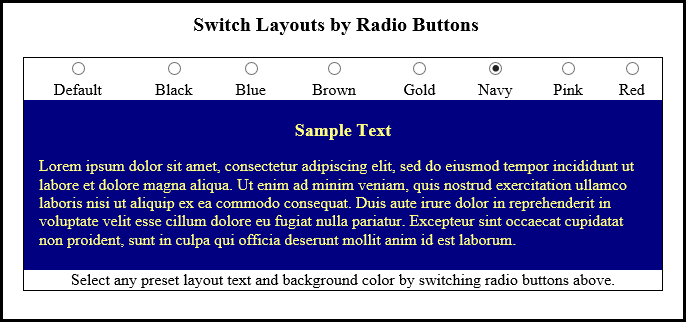

# Switch Layout

This application uses a mix of HTML, JavaScript, and CSS to display different background and text colors. When the
user clicks on a radio button, the layout text and background color displayed changes accordingly. Each of the eight thumbnails
is a different layout. The default layout is a gray background with black text. The user can then choose and switch between
a black, blue, brown, gold, navy, pink, or red background color. This is what the application looks like:

*The image above is a snapshot of what the application looks like when the navy radio button is clicked on by the user.*

Live Demo: https://stellagurin.github.io/Switch-Layout
